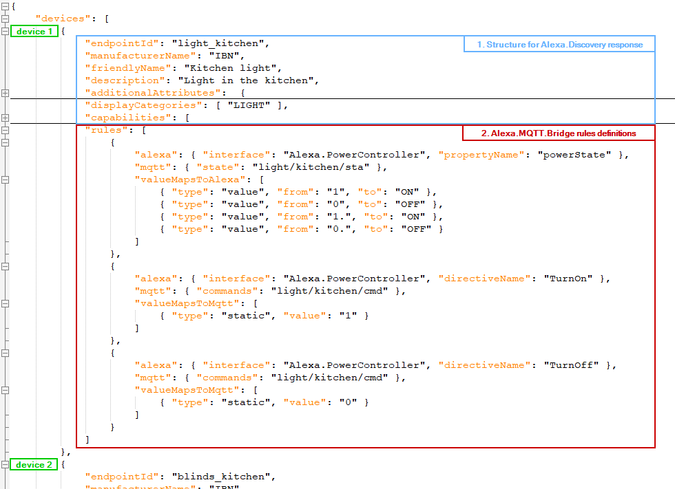

# Directory with sample config

## application.properties
The `application.properties` contains basic configuration. Properties themself are self-explaining, I believe.

## devices.json
The `devices.json` is more complex. It describes your smart home configuration, rules, and value mappings between your home automation system and Alexa Smart Home Skill.

The basic structure is following: there is a `devices` node on the root level, which contains an array of devices in your household: 


### 1. Structure for Alexa.Discovery response
This part is exact structure what needs to be provided as a [Discovery Response](https://developer.amazon.com/en-US/docs/alexa/device-apis/alexa-discovery.html).

**Note:** The structure of this part can be really huge, depends on `additionalAttributes` and `capabilities` on device. 

This part is a free structure - it only needs to be a valid JSON, and supported by Alexa.

For detailed explanation on what devices are supported, their configuration, etc, please see [official documentation](https://developer.amazon.com/en-US/docs/alexa/device-apis/alexa-discovery-objects.html).

### 2. Alexa.MQTT.Bridge rules definitions
This part is an array of rules and mappings for [ReportState](https://developer.amazon.com/en-US/docs/alexa/alexa-voice-service/alexa.html#reportstate) and for different 
Controller APIs (like [PowerController](https://developer.amazon.com/en-US/docs/alexa/device-apis/alexa-powercontroller.html), [RangeController](https://developer.amazon.com/en-US/docs/alexa/device-apis/alexa-rangecontroller.html), etc).

Each `rule` object may contain following nodes:
- `alexa` - are properties for communication with Alexa API's
- `mqtt` - are properties for communication with MQTT topics
- `valueMapsToAlexa` - mapping rules, when it's necessary to convert value received from MQTT topic, before provide to Alexa on ReportState
- `valueMapsToMqtt` - mapping rules, when it's necessary to convert value received from Alexa before publish on MQTT

#### rule.alexa
This node may contain following nodes:
- `alexa.interface` - is an Alexa controller interface, a.k.a. `namespace` in requests and `ReportState` responses. For possible values see appropriate controllers in official Alexa documentation.
- `alexa.instance` - same as above - used as an optional parameter for identification in requests/responses
- `alexa.propertyName` - name of property how it should be provided in the `ReportState` responses.
- `alexa.directiveName` - name of directive, received from Alexa. Each interface has allowed set of directives. Like `Alexa.PowerController` may have `TurnOn` and `TurnOff`. The `Alexa.RangeController` may have `SetRangeValue` and `AdjustRangeValue`, etc. Used in control-rules, when Alexa sends some command to be performed.
- `alexa.payloadValue` - name of property in the payload received command. The property which contains directive-parameter. Optional. For example `Alexa.PowerController.TurnOn` doesn't have any parameters, while `Alexa.RangeController.SetRangeValue` requires a value-parameter. 

#### rule.mqtt
This node may contain following nodes:
- `mqtt.state` - topic name with values received from Home Automation System. Used as a source for `ReportState` responses.
- `mqtt.commands` - topic name for commands to be sent to Home Automation System. Used as target for directives received from Alexa

#### rule.valueMapsToAlex and rule.valueMapsToMqtt
They are array for mappings for values between MQTT topics to Alexa and back.

Each mapping node has structure predefined by `type`.
Following types are supported:

<table>
<tr><th>Type</th><th>Structure</th><th>Description</th></tr>
<tr><td><pre>static</pre></td><td>

```json
{ 
  "type": "static", 
  "value": "1" 
}
```

</td>
<td>Provides a predefined value. For example `Alexa.PowerController.TurnOn` directive doesn't provide any value for conversion, therefore it makes sense to register a `static` mapper here. </td></tr>

<tr><td><pre>value</pre></td><td>

```json
{ 
  "type": "value", 
  "from": "1", "to": "ON" 
 }
 ```

</td>
<td>Makes a simple conversion when input value matches to `from` field. </td></tr>

<tr><td><pre>linearRange</pre></td><td>

```json
{ 
  "type": "linearRange", 
  "fromMin": 12, "fromMax": 0, 
  "toMin": 0, "toMax": 100, 
  "rounded": true 
}
```

</td>
<td>Converts integer and float ranges.</td></tr>


<tr><td><pre>regex</pre></td><td>

```json
{ 
  "type": "regex", 
  "search": "^cmd([0-4]+)$", "replace": "mva$1" 
}
```

</td>
<td>Regular expressions.</td></tr>

<tr><td><pre>formula</pre></td><td>

```json
{ 
  "type": "formula", 
  "formula": "(value-32)*5/9", 
  "rounded": true 
}
```

</td>
<td>Performs calculation according to formula with `value` parameter. Supported expressions can be found on [exp4j page](https://www.objecthunter.net/exp4j/)</td></tr>
</table>

When rule has multiple mappings, they are attempted to be applied in order from first to last. If some mapping can't be applied (for example `value` mapping doesn't match `from` field), then this mapping is skipped, and verified next one. Iteration stopped after first successful conversion.    

# Troubleshooting
Potential misconfigurations may cause either stop of the whole application, or some devices or rules may be ignored.

It's recommended to review application logs after initial setup to locate potential issues: 

```
docker logs alexa_mqtt_bridge
```